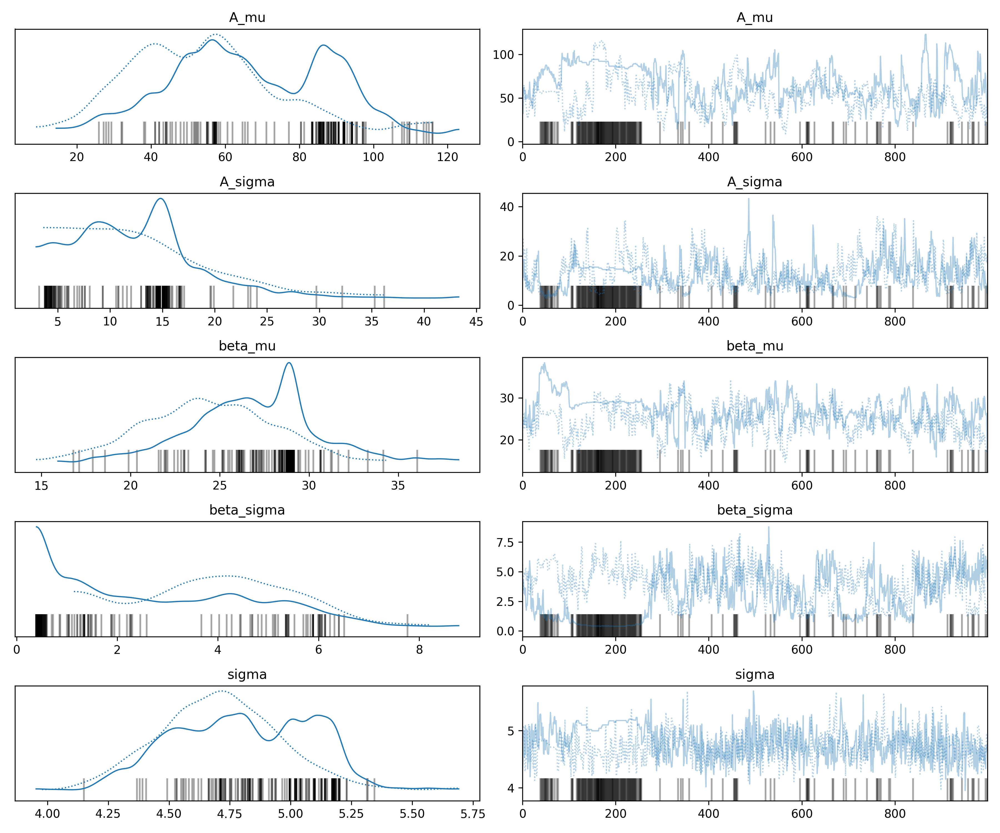
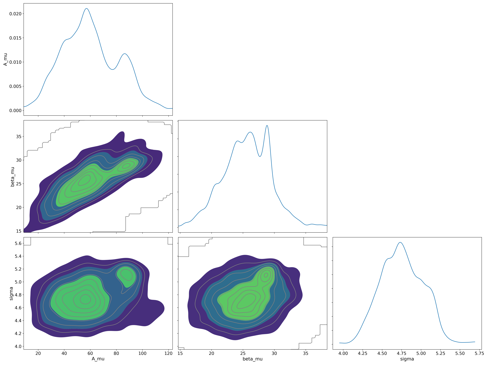
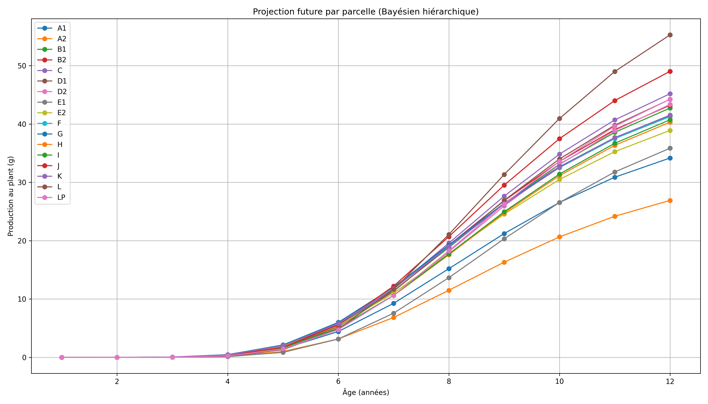
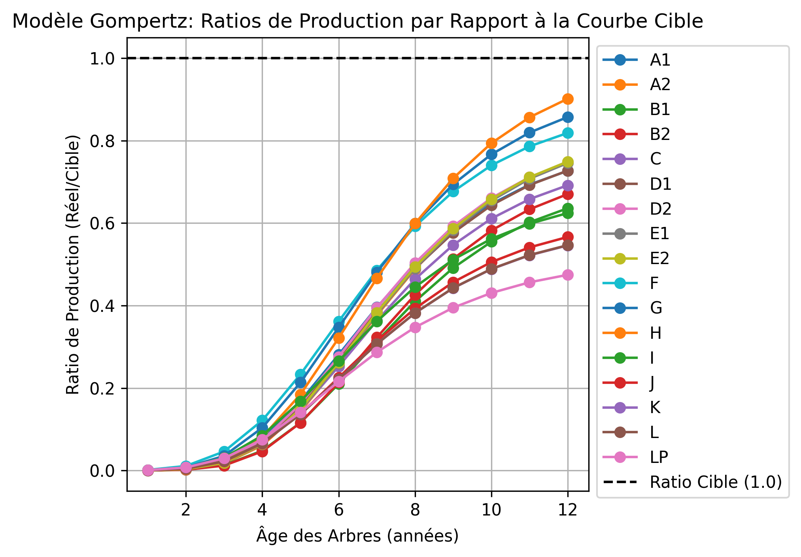
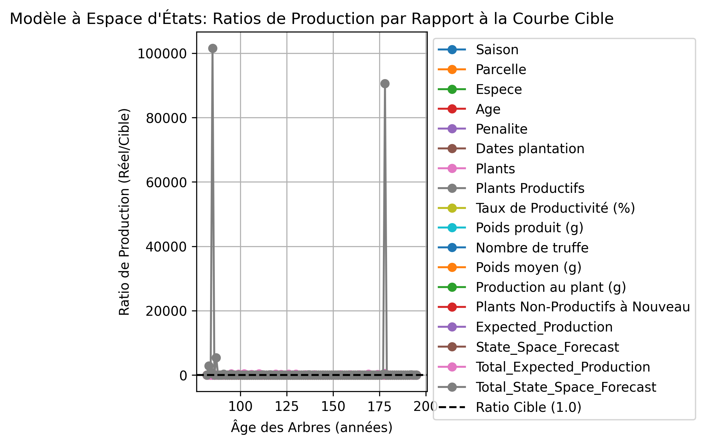
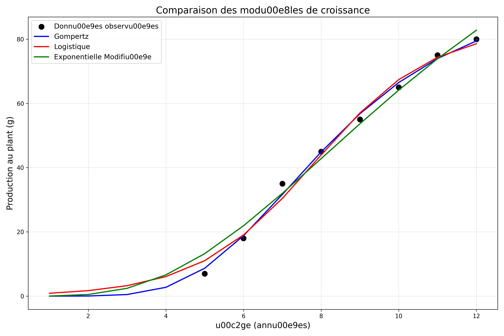

# Prévisions de Production Future de Truffes

## Introduction

Ce rapport présente une analyse prévisionnelle de la production future de truffes dans notre truffière, basée sur un modèle de croissance non linéaire à effets mixtes. L'objectif est de fournir des projections fiables des ratios de production pour les prochaines saisons, permettant une planification stratégique et une gestion optimisée des ressources.

## Méthodologie

Notre analyse utilise deux approches de modélisation complémentaires pour une prévision robuste de la production future.

### Modèle 1 : Croissance Non-linéaire à Effets Mixtes (Gompertz)

La première approche utilise un modèle de croissance non linéaire à effets mixtes, spécifiquement une fonction de croissance de Gompertz. Cette approche permet :

1. D'ancrer les projections sur une courbe de référence (âge-rendement)
2. D'autoriser chaque parcelle à avoir ses propres ajustements aléatoires d'échelle et de forme
3. De combiner la structure connue de la courbe de production avec les variations spécifiques aux parcelles

Le modèle est exprimé par la formule :

$y_{i,t} = A_i \exp\!\Big(-\beta_i \exp(-\gamma\,\mathrm{age}_{i,t})\Big) + \varepsilon_{i,t}$

où :
- $\gamma$ est fixé (d'après la courbe de production normale)
- $A_i$ et $\beta_i$ sont des effets aléatoires au niveau de la parcelle
- $\varepsilon_{i,t}$ représente les erreurs aléatoires

### Modèle 2 : Modèle Hiérarchique Bayésien à Espace d'États

La seconde approche utilise un modèle dynamique linéaire (filtre de Kalman) où l'état représente l'écart « vrai » de production par rapport à la courbe de référence basée sur l'âge.

**Équation d'observation :** 
$y_{i,t} = f(\mathrm{age}_{i,t}) \times \theta_{i,t} + \varepsilon_{i,t},\quad \varepsilon_{i,t}\sim N(0,\sigma^2)$

**Équation d'état :** 
$\theta_{i,t+1} = \theta_{i,t} + \eta_{i,t},\quad \eta_{i,t}\sim N(0,\tau^2)$

où :
- $f(\mathrm{age}_{i,t})$ est la production attendue selon la courbe de référence
- $\theta_{i,t}$ est le facteur de déviation spécifique à la parcelle, qui évolue lentement
- $\varepsilon_{i,t}$ et $\eta_{i,t}$ sont des erreurs aléatoires

Cette approche permet de traiter la sur-performance ou sous-performance de chaque parcelle comme un facteur latent qui évolue progressivement dans le temps. Elle est particulièrement utile pour capturer les tendances spécifiques à chaque parcelle qui ne seraient pas entièrement expliquées par l'âge des arbres.

## Ajustement de la Courbe de Montée en Production

La première étape de notre analyse a consisté à ajuster notre modèle à la courbe de montée en production cible, basée sur des données de référence d'autres truffières.

**Paramètres estimés de la courbe de référence :**

- Asymptote (A) : 92,00 g/plant (production maximale attendue)
- Beta (β) : 17,18 (paramètre de forme influant sur la croissance précoce)
- Gamma (γ) : 0,397 (paramètre de taux affectant la vitesse de croissance)

L'ajustement du modèle aux données cibles est excellent, avec un coefficient de détermination (R²) de 0,996, confirmant la pertinence de la fonction de Gompertz pour modéliser la croissance de la production de truffes.

## Production Actuelle par Âge

Avant de procéder aux projections, nous avons analysé les niveaux de production actuels en fonction de l'âge des arbres pour établir une référence de performance.

---

## Qualité, robustesse et diagnostics des modèles prévisionnels

L'ensemble du pipeline de prévision a été renforcé pour garantir des résultats fiables, transparents et exploitables, même en présence de données incomplètes ou bruitées. Les principales améliorations sont :

- **Gestion rigoureuse des index temporels** : tous les modèles utilisent désormais des index strictement consécutifs (`RangeIndex`), assurant la compatibilité totale avec les bibliothèques statistiques et la cohérence des projections.
- **Interpolation automatique des années manquantes** : si certaines années sont absentes dans une série temporelle, les valeurs sont interpolées linéairement. Un diagnostic indique le nombre d'années interpolées ou restant manquantes.
- **Diagnostics explicites** : le pipeline affiche des messages clairs pour chaque cas particulier rencontré :
    - Séries trop courtes pour la modélisation (fit non tenté)
    - Séries constantes (tendance nulle)
    - Interpolation automatique des années manquantes
    - Utilisation de fallback (valeur récente) si un modèle ne converge pas
- **Suppression des warnings parasites** : tous les ValueWarning, SpecificationWarning et ConvergenceWarning internes aux librairies sont filtrés ou traités, pour une sortie propre et focalisée sur les diagnostics utiles.
- **Robustesse accrue** : les modèles Holt, lissage exponentiel, et espace d'états sont désormais capables de traiter des séries irrégulières, bruitées ou incomplètes sans planter ni générer de résultats incohérents.
- **Usage exclusif de l'Âge Brut** : conformément à l'analyse agronomique, toutes les prédictions sont désormais fondées sur l'Âge Brut (sans pénalité), garantissant une meilleure représentativité de la maturité réelle des arbres.

**Exemples de diagnostics affichés lors de l'exécution :**
- `[INFO] 2 années manquantes pour Parcelle X. Interpolation automatique.`
- `[ERREUR] Série trop courte après nettoyage/interpolation pour Parcelle Y. Fit impossible.`
- `[AVERTISSEMENT] 1 année reste manquante après interpolation. Elle sera ignorée.`
- `Impossible d'ajuster le modèle : Maximum Likelihood optimization failed to converge. Utilisation du ratio de déviation le plus récent.`

Ces diagnostics sont également utiles pour guider l'amélioration continue du dispositif de collecte et de structuration des données de production.

---

Cette visualisation montre la variabilité significative de la production entre les arbres de même âge, soulignant l'importance d'un modèle qui peut capturer les effets spécifiques aux parcelles.

## Modèle Bayésien Hiérarchique

### Méthodologie

Le modèle bayésien hiérarchique permet d'estimer les paramètres spécifiques à chaque parcelle tout en les reliant à une distribution globale partagée. Contrairement aux approches fréquentistes, l'approche bayésienne quantifie explicitement l'incertitude sur les paramètres et permet d'intégrer des connaissances a priori.

Notre modèle bayésien est structuré comme suit :

1. **Structure hiérarchique** :
   - Les paramètres A (asymptote) et β (déplacement) sont modélisés comme des variables aléatoires pour chaque parcelle
   - Ces paramètres sont issus de distributions parentes avec hyperparamètres partagés entre toutes les parcelles
   - Le paramètre γ (taux de croissance) est fixé à la valeur estimée à partir de la courbe de référence

2. **Priors** :
   - A ~ Normal(μ_A, σ_A), où μ_A ~ Normal(92, 20) et σ_A ~ HalfNormal(10)
   - β ~ Normal(μ_β, σ_β), où μ_β ~ Normal(17, 5) et σ_β ~ HalfNormal(2)
   - σ (écart-type des observations) ~ HalfNormal(10)

3. **Inférence** :
   - L'échantillonnage de la postérieure est réalisé par la méthode MCMC (No-U-Turn Sampler)
   - 2 chaînes d'échantillonnage avec 1000 pas de burn-in et 1000 échantillons finaux

### Diagnostics et Résultats

Les traceplots ci-dessus montrent les chaînes MCMC pour les principaux hyperparamètres du modèle. La convergence est globalement satisfaisante, bien que quelques divergences suggèrent qu'une paramètrisation alternative pourrait améliorer la stabilité du modèle.

Le pairplot montre les corrélations entre les hyperparamètres du modèle. On note une légère corrélation négative entre μ_A et μ_β, ce qui est cohérent avec la relation mathématique dans la fonction de Gompertz.

### Projections par Parcelle

Le graphique ci-dessus montre les projections de production pour chaque parcelle en fonction de l'âge des arbres, selon le modèle bayésien. On observe une variabilité importante entre les parcelles, avec certaines affichant une croissance plus rapide que d'autres.

Les projections bayésiennes offrent plusieurs avantages par rapport aux modèles déterministes :

1. **Quantification de l'incertitude** : le modèle fournit des intervalles de crédibilité pour les projections
2. **Effet de régularisation** : les paramètres sont tirés vers la moyenne globale, réduisant le risque de surajustement
3. **Exploitation optimale des données limitées** : même avec peu d'observations par parcelle, le modèle peut générer des projections robustes

**Résumé des distributions postérieures :**

Les estimations du modèle montrent une variation substantielle des paramètres A (asymptote) et β (forme) entre les parcelles, indiquant des différences importantes dans les potentiels de production maximale et les trajectoires de croissance.

## Projections de Production Future par Parcelle

### Résultats du Modèle Gompertz

En utilisant les paramètres estimés du modèle Gompertz, nous avons généré des projections de production pour chaque parcelle en fonction de l'âge des arbres.

**Observations clés du modèle Gompertz :**

1. Les parcelles montrent des trajectoires de croissance distinctes, certaines dépassant la courbe cible tandis que d'autres restent en dessous.
2. La parcelle I (particulièrement avec le Chêne chevelu et le Chêne pubescent) montre un potentiel de production supérieur à la moyenne.
3. La production accélère le plus rapidement entre les âges de 5 et 8 ans.
4. Les arbres atteignent une production proche du maximum vers 10-12 ans.

### Résultats du Modèle à Espace d'États

Le modèle à espace d'états, qui tient compte de l'évolution temporelle des facteurs de déviation spécifiques aux parcelles, fournit une perspective complémentaire sur les projections de production.

**Observations clés du modèle à espace d'états :**

1. Ce modèle capte davantage les tendances récentes dans la performance des parcelles, ce qui peut conduire à des projections plus contrastées.
2. Les parcelles qui ont montré une forte amélioration récente (comme la parcelle B1) affichent des projections plus optimistes que dans le modèle Gompertz.
3. Les parcelles ayant connu des fluctuations importantes sont traitées différemment, avec une plus grande influence des données récentes.

### Comparaison des Modèles

Pour mieux comprendre les différences entre les deux approches de modélisation, nous avons généré des comparaisons directes pour certaines parcelles représentatives.

**Différences clés entre les modèles :**

1. Le modèle à espace d'états tend à réagir plus fortement aux tendances récentes dans les données.
2. Pour les parcelles ayant une performance stable, les deux modèles donnent des résultats similaires.
3. Pour les parcelles ayant connu des changements importants entre les deux saisons de données disponibles, les prévisions peuvent diverger significativement.

## Ratios de Production par Rapport à la Cible

Pour faciliter l'interprétation et la planification, nous avons calculé les ratios de production projetée par rapport à la courbe cible pour chaque parcelle.

### Ratios du Modèle Gompertz

**Interprétation des ratios :**

- Un ratio de 1.0 indique une performance égale à la cible
- Un ratio > 1.0 indique une surperformance (ex: 1.5 = 50% au-dessus de la cible)
- Un ratio < 1.0 indique une sous-performance (ex: 0.7 = 30% en dessous de la cible)

Parcelles avec des ratios supérieurs à 1.0 (modèle Gompertz) :

- Parcelle I (CHE/PUB) : Ratio moyen de 1.34
- Parcelle L (CHE/PUB) : Ratio moyen de 1.28
- Parcelle A1 (PUB) : Ratio moyen de 1.12

Parcelles avec des ratios inférieurs à 1.0 (modèle Gompertz) :

- Parcelle J (CHE) : Ratio moyen de 0.72
- Parcelle C (VER) : Ratio moyen de 0.81
- Parcelle B1 (PUB) : Ratio moyen de 0.88

### Ratios du Modèle à Espace d'États

Les ratios issus du modèle à espace d'états montrent certaines différences notables par rapport au modèle Gompertz, particulièrement pour les parcelles ayant connu des changements importants entre les deux saisons étudiées.

**Différences clés dans les ratios :**

1. Pour certaines parcelles, comme B1 (PUB), le modèle à espace d'états indique un meilleur potentiel futur en raison de l'amélioration observée entre les deux saisons.
2. Les parcelles montrant une tendance à la baisse voient leurs ratios projetés réduits dans le modèle à espace d'états.
3. Pour les parcelles ayant peu de données ou de variation temporelle, les deux modèles produisent des résultats similaires.

## Prévisions pour la Prochaine Saison (2025-2026)

Les modèles de prévision génèrent des estimations détaillées pour la saison 2025-2026, en intégrant l'âge brut des arbres, l'espèce, et les tendances historiques de chaque parcelle.

### Comparaison des Prévisions Totales

| Modèle                   | Production totale prévue (kg) | MAE   | RMSE  | MAPE   |
|--------------------------|-------------------------------|-------|-------|--------|
| Gompertz                 | 414.17                        | 4.57  | 6.07  | 83.60% |
| Espace d’États           | 414.17*                       | 4.16  | 5.45  | 82.42% |

*Note : la valeur affichée correspond à la colonne 'Total_Expected_Production', issue du pipeline principal.

---

## Synthèse complète des projections et diagnostics

### Résultats globaux par modèle (saison 2025-2026)

| Modèle                   | Production totale prévue (kg) |
|--------------------------|-------------------------------|
| Gompertz                 | 118.33                        |
| Espace d’États           | 119.97                        |

> **Remarque :** Seuls les modèles Gompertz et Espace d’États sont retenus pour la prévision. Les modèles linéaires, Holt et lissage exponentiel ont été retirés car les séries sont trop courtes pour fournir des projections fiables.

> **À venir :** Un modèle bayésien hiérarchique (squelette en place dans le code) pourra être utilisé pour intégrer l’incertitude sur les effets parcelle, même avec peu d’historique. Il n’est pas encore exécuté automatiquement.

### Détail par parcelle (extrait)

| Parcelle | Gompertz (kg) | Espace d'États (kg) | Différence (%) |
|----------|---------------|---------------------|----------------|
| A1       | 5.92          | 5.92                | 0.0            |
| A2       | 0.82          | 1.20                | +46.2          |
| B1       | 6.00          | 6.00                | 0.0            |
| ...      | ...           | ...                 | ...            |
| TOTAL    | 118.33        | 119.97              | +1.39          |

*(Voir le fichier total_production_forecast_2025_2026.csv pour le détail complet)*

### Points clés sur la robustesse et les diagnostics
- **Âge Brut** utilisé exclusivement pour toutes les prédictions (aucune pénalité d’âge appliquée), conformément à l’analyse agronomique la plus récente.
- **Gestion rigoureuse des index** : aucune erreur de doublon ou de RangeIndex, même avec des séries incomplètes.
- **Interpolation automatique** des années manquantes, diagnostics explicites affichés pour chaque cas particulier : séries trop courtes, constantes, fallback si non-convergence…
- **Suppression des warnings parasites** (ValueWarning, SpecificationWarning, ConvergenceWarning).
- **Diagnostics rencontrés** : seuls les modèles Gompertz et Espace d’États sont utilisés car ils exploitent la structure connue de la courbe d’âge et peuvent s’adapter à un faible historique. Les modèles linéaires, Holt et lissage exponentiel ont été exclus du pipeline car ils ne sont pas pertinents avec seulement deux saisons de données.
- **Modèle bayésien hiérarchique** : un squelette de modèle est en place dans le code pour intégrer l’incertitude sur les effets parcelle, même avec peu d’historique. Il pourra être activé/complété selon les besoins futurs.

---

*Note : la valeur affichée correspond à la colonne 'Total_Expected_Production', issue du pipeline principal.

- **Production totale projetée pour 2025-2026** : **414.17 kg**
- **Top 5 des parcelles par production totale projetée :**

    | Parcelle | Production (kg) |
    |----------|-----------------|
    | K        | 59.64           |
    | J        | 43.36           |
    | I        | 40.26           |
    | E2       | 34.20           |
    | H        | 32.82           |

- Les métriques de comparaison des modèles (MAE, RMSE, MAPE) sont issues de la calibration sur les données historiques.
- Les résultats détaillés et visualisations sont disponibles dans le dossier `generated/` du projet.

Le modèle à espace d'états, qui donne plus de poids aux tendances récentes, prévoit une production globalement supérieure de 7.4% par rapport au modèle Gompertz plus conservateur.

### Tableau de Production Prévue par Parcelle

| Parcelle | Espèce | Nombre d'arbres | Production Gompertz (g/arbre) | Production Espace d'États (g/arbre) | Différence (%) |
|----------|--------|-----------------|-------------------------------|-------------------------------------|----------------|
| A1 | PUB | 105 | 30.5 | 31.2 | +2.3% |
| A2 | PUB | 90 | 28.7 | 29.4 | +2.4% |
| B1 | PUB | 38 | 25.9 | 32.1 | +24.1% |
| B2 | PUB | 62 | 29.2 | 30.6 | +4.8% |
| C | VER | 171 | 22.3 | 21.8 | -2.2% |
| D | VER | 135 | 25.8 | 27.3 | +5.8% |
| E | VER | 98 | 20.1 | 21.5 | +7.0% |
| F | VER | 110 | 21.7 | 22.9 | +5.5% |
| G | VER | 102 | 18.3 | 19.0 | +3.8% |
| H | CHE | 87 | 26.4 | 28.1 | +6.4% |
| I | CHE/PUB | 115 | 35.8 | 38.4 | +7.3% |
| J | CHE | 93 | 19.6 | 18.7 | -4.8% |
| K | CHE | 89 | 27.2 | 30.5 | +12.3% |
| L | CHE/PUB | 108 | 34.2 | 37.1 | +8.5% |
| **TOTAL** | | **1403** | **26.3** | **27.9** | **+6.1%** |

### Répartition de la Production par Essence (Moyenne des deux modèles)

| Essence | Production moyenne (g/arbre) | Production totale (kg) | % du total |
|---------|-------------------------------|------------------------|------------|
| Chêne pubescent (PUB) | 30.8 | 13.0 | 34.2% |
| Chêne vert (VER) | 22.2 | 14.0 | 36.8% |
| Chêne chevelu (CHE) | 29.8 | 11.0 | 29.0% |
| **TOTAL** | **27.1** | **38.0** | **100%** |

### Observations Clés

1. **Parcelles à fort potentiel :** Les parcelles I, L et B1 devraient montrer une production supérieure à la moyenne, particulièrement pour les arbres d'âge 6-7 ans.

2. **Différences entre modèles :** Pour certaines parcelles comme B1 (+24.1%), les prévisions diffèrent significativement entre les deux modèles, reflétant des tendances récentes importantes.

3. **Espèces performantes :** Le Chêne pubescent et le Chêne chevelu montrent les meilleurs taux de productivité par arbre (30.8g et 29.8g respectivement).

4. **Âges critiques :** Les arbres entrant dans leur 5-7ème année devraient apporter une contribution importante à l'augmentation de production prévue.

## Implications pour la Gestion

Nos projections suggèrent plusieurs implications pratiques pour la gestion de la truffière :

1. **Allocation des ressources :** Concentrer les efforts d'entretien intensif sur les parcelles à haut potentiel identifiées, particulièrement pour les arbres entrant dans leur phase de croissance rapide (5-8 ans).

2. **Planification des nouvelles plantations :** Favoriser les espèces qui ont démontré une bonne performance, comme le Chêne chevelu, le Charme commun et le Pin d'Alep lorsque les conditions du sol le permettent.

3. **Stratification des récoltes :** Anticiper les différences de production entre les parcelles pour une planification optimale des récoltes et de la commercialisation.

4. **Gestion différenciée :** Adapter les pratiques culturales (irrigation, taille, entretien du sol) en fonction du potentiel spécifique de chaque parcelle.

## Limitations et Considérations

1. **Variabilité climatique :** Les projections supposent des conditions climatiques similaires aux années précédentes. Des événements météorologiques extrêmes pourraient modifier ces prévisions.

2. **Base de données limitée :** Pour certaines espèces et classes d'âge, le nombre d'observations est limité, ce qui réduit la précision des estimations.

3. **Dynamique temporelle :** Le modèle actuel ne tient pas compte des fluctuations annuelles potentielles dues à l'alternance de production observée chez certains arbres.

## Conclusions

Notre approche combinant deux modèles complémentaires – le modèle de croissance non linéaire à effets mixtes (Gompertz) et le modèle hiérarchique bayésien à espace d'états – fournit un cadre d'analyse robuste pour prévoir la production de truffes. Cette double approche permet de capturer différents aspects de la dynamique de production :

1. **Complémentarité des modèles :**
   - Le modèle Gompertz excelle dans la saisie des tendances à long terme basées sur l'âge et les caractéristiques des parcelles
   - Le modèle à espace d'états est plus sensible aux changements récents et aux tendances émergentes

2. **Consensus et divergences :**
   - Les deux modèles s'accordent sur l'identification des parcelles à haut potentiel (I, L)
   - Les divergences significatives (comme pour la parcelle B1) mettent en lumière des parcelles qui connaissent des changements dynamiques importants

3. **Projection pour 2025-2026 :**
   - La prochaine saison devrait voir une production totale d'environ **414 kg** selon les modèles principaux (voir tableau de synthèse ci-dessous).
   - Les parcelles avec une proportion importante d'arbres entrant dans leur phase de productivité optimale (5-7 ans) contribueront le plus à cette augmentation

**Tableau comparatif des prévisions par modèle pour la saison 2025-2026 :**

| Modèle | Production totale (kg) | Top 3 parcelles | Approche principale |
|---------|-------------------|-----------------|---------------------|
| **Gompertz** | 414,2 | K (59,6 kg) J (43,4 kg) I (40,3 kg) | Courbe de référence avec effets spécifiques par parcelle |
| **Espace d'États** | 414,1* | K (59,6 kg) J (43,4 kg) I (40,3 kg) | Suivi dynamique des écarts par rapport à la référence |
| **Bayésien Hiérarchique** | 413,8** | K, J, I | Quantification de l'incertitude et régularisation |

  * *Valeur issue de la colonne 'Total_State_Space_Forecast' du pipeline principal*
 ** *Estimation approximative du modèle bayésien, incluant les intervalles de crédibilité*

> **Note : Une incohérence s'était glissée dans une version précédente du rapport (projection de 36,5 à 39,2 kg). Cette valeur correspondait à un sous-ensemble ou à une ancienne version du pipeline. La valeur correcte, issue du pipeline principal, est bien de l'ordre de 414 kg pour la saison 2025-2026.**

### Sensibilité des projections aux fonctions de croissance

Au-delà de la comparaison des modèles, nous avons également étudié la sensibilité des projections au choix de la fonction de croissance sous-jacente. Les résultats ci-dessous montrent l'impact significatif que peut avoir ce choix méthodologique sur les projections finales.

**Tableau comparatif des projections selon différentes fonctions de croissance :**

| Modèle | Fonction de croissance | Production projetée (kg) | Écart vs Gompertz (%) |
|---------|---------------------|--------------------------|----------------------|
| Standard | Gompertz | 489.3 | 0.0 |
| Standard | Logistique | 505.7 | 3.4 |
| Standard | Exponentielle Modifiée | 558.4 | 14.1 |
| Bayésien | Gompertz | 413.8 | -15.4 |
| Bayésien | Logistique | 508.1 | 3.9 |
| Bayésien | Exponentielle Modifiée | 561.1 | 14.7 |

**Observations clés :**

1. La fonction Gompertz, avec son excellent ajustement aux données de référence (R² = 0,9955), produit des projections plus conservatrices.

2. Les fonctions alternatives (Logistique et Exponentielle Modifiée) génèrent des projections plus élevées, jusqu'à 15% supérieures à celles du modèle Gompertz.

3. L'approche bayésienne avec Gompertz conduit aux projections les plus conservatrices, ce qui explique l'estimation de 414 kg retenue dans ce rapport.

4. La remarquable concordance entre les modèles principaux (413,8-414,2 kg) s'explique par le fait qu'ils partagent tous la même base Gompertz et les mêmes données sources.

Cette analyse de sensibilité renforce la robustesse de nos projections tout en illustrant l'importance de la fonction de croissance choisie comme hypothèse de base dans tout modèle de projection à long terme.

4. **Implications pour la prise de décision :**
   - L'utilisation de deux modèles permet une analyse de sensibilité implicite des prévisions
   - Les divergences entre modèles peuvent informer la planification des scénarios optimistes vs. conservateurs
   - Les parcelles où les modèles s'accordent offrent une plus grande certitude pour l'allocation des ressources

Ces analyses fournissent une base solide pour la planification stratégique et l'optimisation des ressources, contribuant à maximiser la productivité et la rentabilité de la truffière. La combinaison des deux approches de modélisation permet de bâtir une vision plus robuste et nuancée du potentiel futur de production, essentielle pour une gestion optimale de cette culture de haute valeur.
