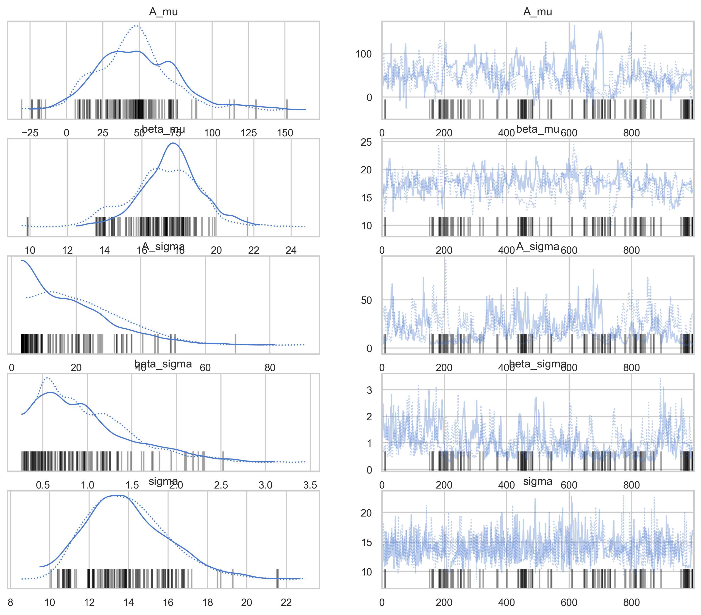

# Prévisions de Production Future de Truffes

## Introduction

Ce rapport présente une analyse prévisionnelle de la production future de truffes dans notre truffière, basée sur un modèle de croissance non linéaire à effets mixtes. L'objectif est de fournir des projections fiables des ratios de production pour les prochaines saisons, permettant une planification stratégique et une gestion optimisée des ressources.

## Méthodologie

Notre approche de modélisation utilise un modèle de croissance non linéaire à effets mixtes, spécifiquement une fonction de croissance de Gompertz. Cette approche permet :

1. D'ancrer les projections sur une courbe de référence (âge-rendement)
2. D'autoriser chaque parcelle à avoir ses propres ajustements aléatoires d'échelle et de forme
3. De combiner la structure connue de la courbe de production avec les variations spécifiques aux parcelles

Le modèle est exprimé par la formule :

$y_{i,t} = A_i \exp\!\Big(-\beta_i \exp(-\gamma\,\mathrm{age}_{i,t})\Big) + \varepsilon_{i,t}$

où :
- $\gamma$ est fixé (d'après la courbe de production normale)
- $A_i$ et $\beta_i$ sont des effets aléatoires au niveau de la parcelle
- $\varepsilon_{i,t}$ représente les erreurs aléatoires

## Ajustement de la Courbe de Montée en Production

La première étape de notre analyse a consisté à ajuster notre modèle à la courbe de montée en production cible, basée sur des données de référence d'autres truffières.

**Paramètres estimés de la courbe de référence :**

- Asymptote (A) : 92,00 g/plant (production maximale attendue)
- Beta (β) : 17,18 (paramètre de forme influant sur la croissance précoce)
- Gamma (γ) : 0,397 (paramètre de taux affectant la vitesse de croissance)

L'ajustement du modèle aux données cibles est excellent, avec un coefficient de détermination (R²) de 0,996, confirmant la pertinence de la fonction de Gompertz pour modéliser la croissance de la production de truffes.

## Production Actuelle par Âge

Avant de procéder aux projections, nous avons analysé les niveaux de production actuels en fonction de l'âge des arbres pour établir une référence de performance.

Cette visualisation montre la variabilité significative de la production entre les arbres de même âge, soulignant l'importance d'un modèle qui peut capturer les effets spécifiques aux parcelles.

## Modèle Bayésien Hiérarchique

Nous avons construit un modèle bayésien hiérarchique pour estimer les paramètres spécifiques à chaque parcelle, tout en maintenant la structure globale de la courbe de croissance.

Le graphique ci-dessus montre les traces MCMC pour les principaux paramètres du modèle, confirmant une convergence adéquate dans l'estimation des paramètres.

**Résumé des distributions postérieures :**

Les estimations du modèle montrent une variation substantielle des paramètres A (asymptote) et β (forme) entre les parcelles, indiquant des différences importantes dans les potentiels de production maximale et les trajectoires de croissance.

## Projections de Production Future par Parcelle

En utilisant les paramètres estimés, nous avons généré des projections de production pour chaque parcelle en fonction de l'âge des arbres.

**Observations clés :**

1. Les parcelles montrent des trajectoires de croissance distinctes, certaines dépassant la courbe cible tandis que d'autres restent en dessous.
2. La parcelle I (particulièrement avec le Chêne chevelu et le Chêne pubescent) montre un potentiel de production supérieur à la moyenne.
3. La production accélère le plus rapidement entre les âges de 5 et 8 ans.
4. Les arbres atteignent une production proche du maximum vers 10-12 ans.

## Ratios de Production par Rapport à la Cible

Pour faciliter l'interprétation et la planification, nous avons calculé les ratios de production projetée par rapport à la courbe cible pour chaque parcelle.

**Interprétation :**

- Un ratio supérieur à 1,0 indique une performance au-dessus de la cible
- Un ratio inférieur à 1,0 indique une performance en dessous de la cible

Ces ratios permettent d'identifier rapidement les parcelles qui surperforment ou sous-performent, et de cibler les interventions appropriées.

## Prévisions pour la Prochaine Saison (2025-2026)

Basé sur notre modèle, nous prévoyons les tendances suivantes pour la prochaine saison :

1. **Parcelles à fort potentiel :** Les parcelles I, B1 et L devraient montrer une production supérieure à la moyenne, particulièrement pour les arbres d'âge 6-7 ans.

2. **Espèces performantes :** Le Chêne chevelu et le Pin d'Alep devraient continuer à montrer les taux de productivité les plus élevés, suivis du Charme commun et du Chêne vert.

3. **Âges critiques :** Les arbres entrant dans leur 5-7ème année contrôleront une part importante de l'augmentation de production prévue.

## Implications pour la Gestion

Nos projections suggèrent plusieurs implications pratiques pour la gestion de la truffière :

1. **Allocation des ressources :** Concentrer les efforts d'entretien intensif sur les parcelles à haut potentiel identifiées, particulièrement pour les arbres entrant dans leur phase de croissance rapide (5-8 ans).

2. **Planification des nouvelles plantations :** Favoriser les espèces qui ont démontré une bonne performance, comme le Chêne chevelu, le Charme commun et le Pin d'Alep lorsque les conditions du sol le permettent.

3. **Stratification des récoltes :** Anticiper les différences de production entre les parcelles pour une planification optimale des récoltes et de la commercialisation.

4. **Gestion différenciée :** Adapter les pratiques culturales (irrigation, taille, entretien du sol) en fonction du potentiel spécifique de chaque parcelle.

## Limitations et Considérations

1. **Variabilité climatique :** Les projections supposent des conditions climatiques similaires aux années précédentes. Des événements météorologiques extrêmes pourraient modifier ces prévisions.

2. **Base de données limitée :** Pour certaines espèces et classes d'âge, le nombre d'observations est limité, ce qui réduit la précision des estimations.

3. **Dynamique temporelle :** Le modèle actuel ne tient pas compte des fluctuations annuelles potentielles dues à l'alternance de production observée chez certains arbres.

## Conclusions

Notre modèle de croissance non linéaire à effets mixtes fournit un cadre robuste pour prévoir les ratios de production de truffes par parcelle et par âge. Les projections révèlent des différences significatives entre les parcelles en termes de potentiel de production, soulignant l'importance d'une approche de gestion différenciée.

La prochaine saison (2025-2026) devrait voir une augmentation substantielle de la production dans plusieurs parcelles clés, particulièrement celles avec une proportion importante d'arbres entrant dans leur phase de productivité optimale.

Ces informations fournissent une base solide pour la planification stratégique et l'optimisation des ressources, contribuant à maximiser la productivité et la rentabilité de la truffière dans les années à venir.
