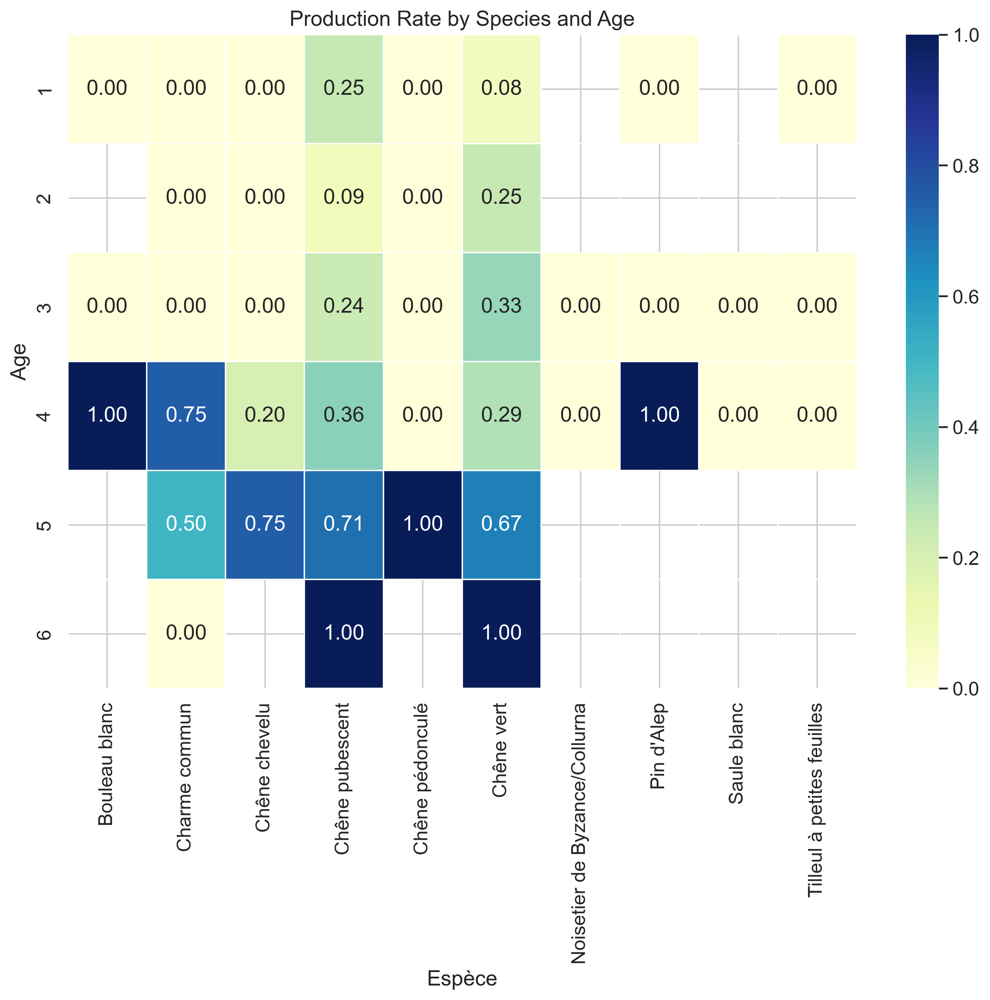
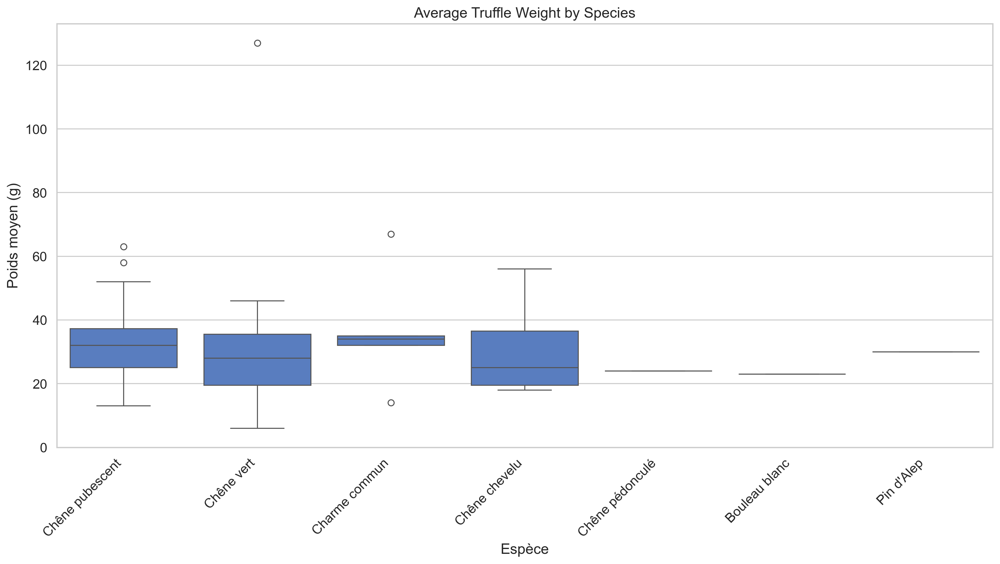
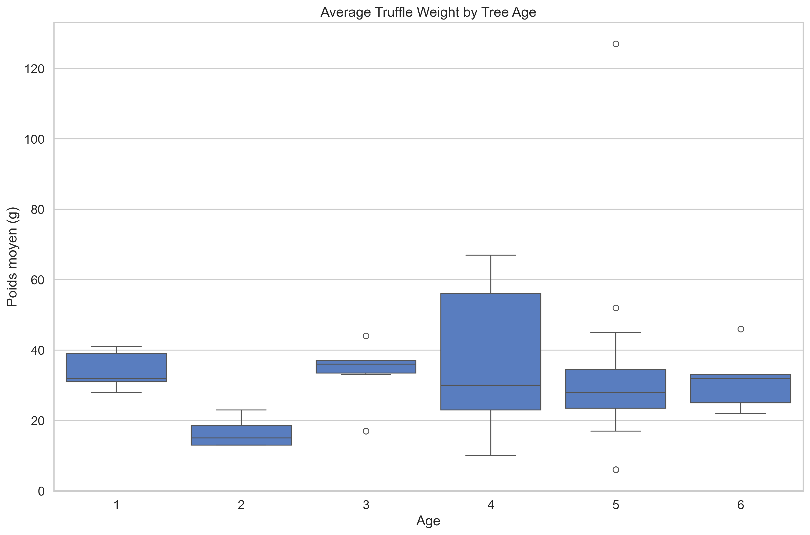
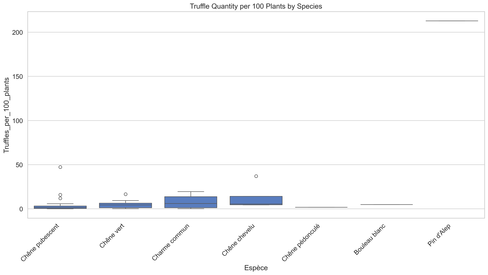
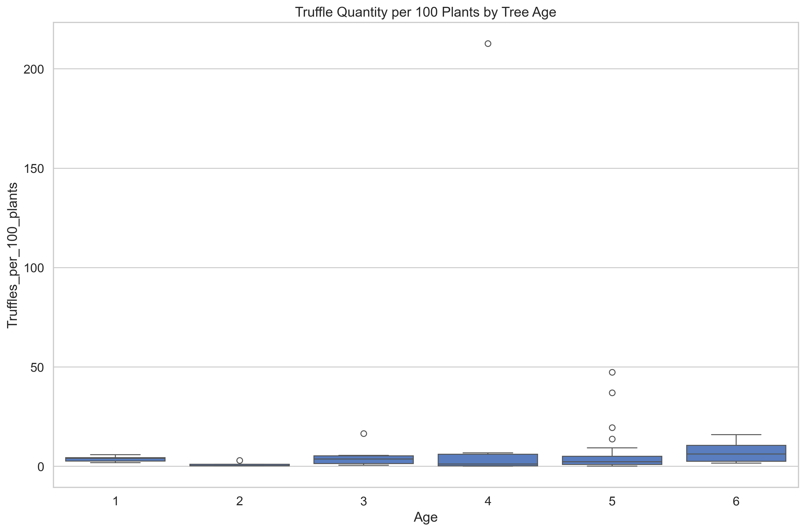
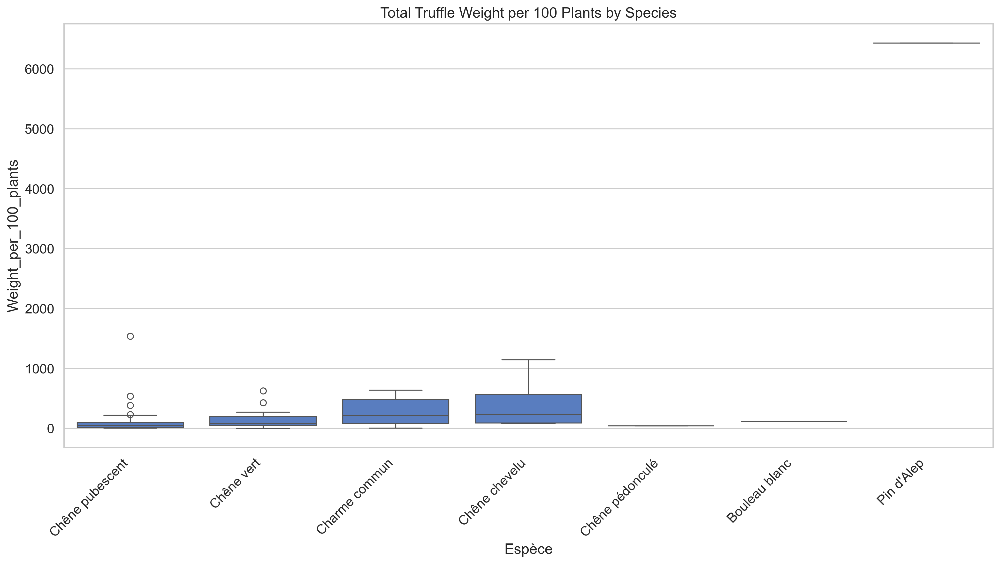
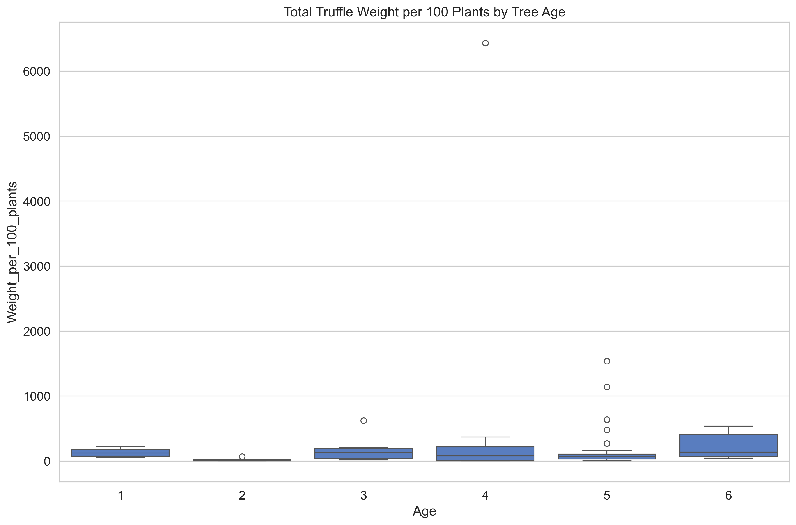
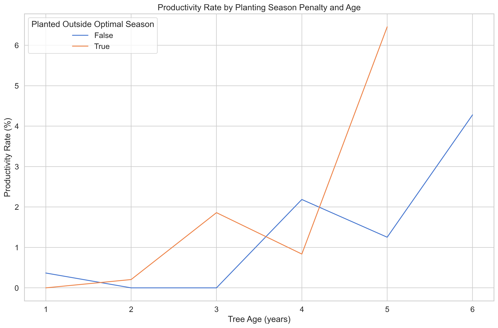
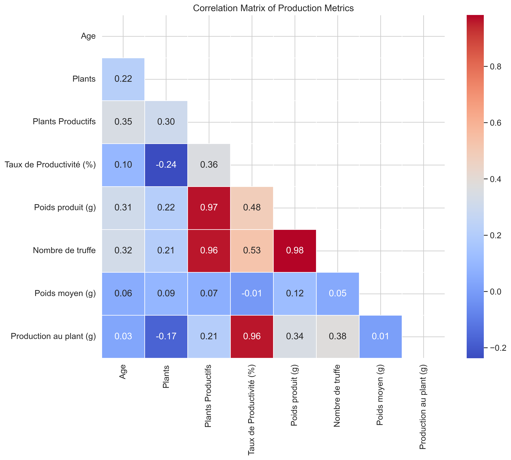

# Analyse de la Production Passée de Truffes

## Introduction

Ce rapport présente une analyse détaillée de la production de truffes dans notre truffière pour les saisons 2023-2024 et 2024-2025. L'objectif est de comprendre les facteurs qui influencent la production, notamment l'âge des arbres, les espèces d'arbres hôtes, et les conditions de plantation.

## Données Analysées

Notre analyse est basée sur les données de production collectées sur différentes parcelles, avec plusieurs espèces d'arbres et différentes classes d'âge. Les principales métriques analysées sont :

- La précocité de production (quand les arbres commencent à produire)
- Le poids moyen des truffes
- La quantité de truffes produites par arbre
- Le poids total produit

## Précocité de Production par Espèce et Âge

La précocité de production est un facteur économique important pour une truffière. Notre analyse révèle des différences significatives entre les espèces d'arbres quant à l'âge auquel ils commencent à produire des truffes.

**Principales observations :**

- Les Chênes pubescents et les Chênes verts sont les plus précoces, certains commençant à produire dès l'âge de 1 an.
- Les Charmes communs, Chênes chevelus, Bouleaux blancs et Pins d'Alep commencent généralement à produire à partir de 4 ans.
- Les Chênes pédonculés sont les plus tardifs, ne commençant à produire qu'à partir de 5 ans.

L'analyse statistique montre un effet significatif de l'âge sur la probabilité de production (p<0,001). Pour chaque année supplémentaire, les chances de production augmentent considérablement.

## Poids Moyen des Truffes par Espèce

Le poids moyen des truffes est un indicateur de qualité important et influence directement la valeur marchande.

**Observations clés :**

- Le Charme commun produit les truffes les plus lourdes (36,4g en moyenne)
- Le Chêne vert montre la plus grande variabilité de poids (certaines atteignant 127g)
- La plupart des espèces produisent des truffes d'un poids moyen entre 30g et 35g

## Poids Moyen des Truffes par Âge

Contrairement à ce qu'on pourrait attendre, l'âge des arbres n'a qu'un impact minimal sur le poids des truffes.

L'analyse de régression montre une légère augmentation du poids moyen avec l'âge (0,71g par année supplémentaire), mais cette relation n'est pas statistiquement significative (p=0,67).

## Quantité de Truffes par Espèce

La productivité en nombre de truffes varie considérablement selon les espèces.

**Points notables :**

- Le Pin d'Alep montre une productivité exceptionnelle (212,8 truffes pour 100 plants)
- Le Chêne chevelu (13,1) et le Charme commun (8,1) sont les suivants en termes de productivité
- Le Chêne pédonculé a la productivité la plus faible (1,7 truffes pour 100 plants)

## Quantité de Truffes par Âge

La quantité de truffes augmente légèrement avec l'âge, mais cette relation n'est pas statistiquement significative (p=0,77).

## Production Totale en Poids par Espèce

Le poids total produit est l'indicateur le plus direct de la productivité économique.

**Observations importantes :**

- Le Pin d'Alep se distingue avec une production exceptionnelle (6.433g pour 100 plants)
- Le Chêne chevelu (421g) et le Charme commun (282g) montrent également une forte production
- Le Chêne pédonculé a la production la plus faible (41g pour 100 plants)

## Production Totale en Poids par Âge

Chaque année d'âge supplémentaire ajoute environ 22,4g de production de truffes pour 100 plants, mais cette tendance n'est pas statistiquement significative (p=0,78).

## Effet de la Saison de Plantation

Nous avons analysé si la plantation hors saison optimale (qui entraîne une pénalité d'âge) affecte la productivité des arbres.

Les arbres plantés en dehors de leur saison optimale ne montrent pas de différence significative en termes de taux de productivité par rapport à ceux plantés pendant les saisons optimales, lorsqu'on contrôle pour l'âge.

## Corrélations entre Métriques de Production

L'analyse des corrélations révèle les relations entre les différentes métriques de production.

**Corrélations principales avec l'âge :**

- Nombre de plants productifs (r=0,35)
- Nombre de truffes produites (r=0,32)
- Poids total produit (r=0,31)
- Taux de productivité (r=0,10)
- Poids moyen des truffes (r=0,06)

## Conclusions et Recommandations

1. **Sélection des espèces :** Si l'objectif est de maximiser la production, le Pin d'Alep devrait être considéré pour l'expansion, suivi du Chêne chevelu et du Charme commun. Cependant, le résultat concernant le Pin d'Alep est basé sur un seul point de données et devrait être validé.

2. **Gestion de l'âge :** Les données confirment que les arbres plus âgés sont significativement plus susceptibles de produire, mais l'âge a un impact minimal sur la qualité des truffes (poids). Cela suggère de concentrer les ressources sur le maintien de la santé des arbres plus âgés plutôt que d'attendre des truffes de haute qualité des jeunes arbres.

3. **Saison de plantation :** L'absence d'effet significatif de la pénalité suggère une certaine flexibilité dans les périodes de plantation, bien que le respect des calendriers de plantation optimaux reste recommandé selon les meilleures pratiques générales de culture de la truffe.

## Perspectives

Cette analyse fournit une base solide pour la prise de décision concernant la gestion future de la truffière. Des analyses supplémentaires pourraient être menées pour explorer l'impact d'autres facteurs comme les conditions météorologiques, les pratiques d'irrigation, ou les traitements du sol sur la production de truffes.
